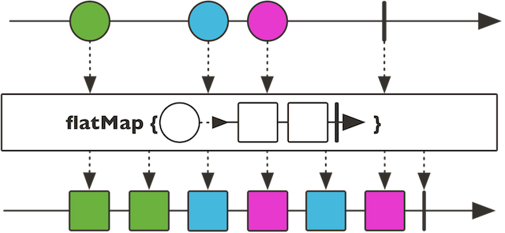

## reactor framework

### Flux.fromIterable()

iterable 객체를 Flux로 변환

### publisher.log()


Publisher를 상속하는 Mono와 Flux 객체에서 사용할 수 있는 함수.

> Observe all Reactive Streams signals and trace them

퍼블리셔에 대한 리액티브 스트림 시그널(onSubscribe, onNext, onComplete, onError 호출 등)을 확인할 수 있고, 멀티 스레딩 환경이라면 어느 스레드에서 작동하는지 등에 대한 정보도 확인할 수 있다.

### map vs flatmap

map 함수는 인자로 전달하는 함수의 리턴 값이 꼭 퍼블리셔가 아니어도 되고, 기존의 자바 스트림이나 다른 언어들에서 익히 사용하는 map함수와 상당히 비슷하다.

하지만 flatMap 함수는 인자로 전달하는 함수의 리턴 값이 퍼블리셔 객체여야 하며, 이 함수가 리턴하는 퍼블리셔는 각각의 퍼블리셔로 남는게 아니라 하나의 시퀀스로 flatten 하게 된다.

```kotlin
    val flux = Flux.just(1, 2, 3)
    val map: Flux<Flux<Int>> = flux.map { Flux.range(0, it) }
    val flatMap: Flux<Int> = flux.flatMap { Flux.range(0, it) } // 자료형이 map과 다르다.
```

### flatMap, concatMap, flatMapSequential

퍼블리셔가 방출하는 원소들을 매핑해서 새로운 퍼블리셔로 만들어주는 함수들이다. flatMap은 다른 두 함수와는 다르게 기존 퍼블리셔에 들어 있는 원소의 순서가 유지될 것을 보장하지 않는다. concatMap와 flatMapSequential의 차이는 concatMap은 기존 퍼블리셔의 스트림을 거의(완전히?) 동기식으로 차례차례 처리하지만, flatMapSequential은 비동기식으로 작업을 처리하면서도 기존의 순서를 유지한다는 것이다.



### groupBy

Flux 객체를 특정 조건에 따라 grouping하고 싶을 때 사용한다. 반환값은 `Flux<GroupedFlux>`로, GroupedFlux는 map 자료구조와 비슷한 성질을 띤다. key() 함수와 이 key의 개수를 나타내는 count() 함수를 호출할 수 있다.

### distinct

Flux 객체에 distinct를 사용하면 Flux 객체가 갖고 있는 원소의 중복을 없애서 새로운 Flux 객체를 만들어준다.

### collectionList

Flux 객체 안의 원소들을 List로 묶어서 Mono로 반환한다.

### subscribe

퍼블리셔 객체들을 구독한다. kotlin 문법에 따르면, 단순히 onNext 함수만을 전달해줘도 되고 onError와 onComplete 함수를 함께 전달해줄 수도 있다.

### Flux.zip

여러 개의 스트림을 하나로 묶을 때 사용한다. 코틀린에서 사용할 땐 인자로 전달하는 집계 함수(?)에 `BiFuction` 키워드를 명시해주어야 한다.

### publish

기본적으로 cold 상태인 퍼블리셔를 hot 상태로 만든다. cold 퍼블리셔는 구독전까지 아무런 정보도 퍼블리싱하지 않다가 구독자가 생기면 그 때마다 정보를 퍼블리싱하는데, hot 퍼블리셔는 정보의 퍼블리싱이 구독과는 상관없이 발생할 수 있다.

### autoconnect

autoconnect는 hot 상태의 퍼블리셔에 사용할 수 있는 함수이다. 이 함수의 인자로 전달한 갯수만큼의 구독자가 붙으면 그때부터 모든 구독자에게 동시에 같은 정보를 퍼블리싱한다.
